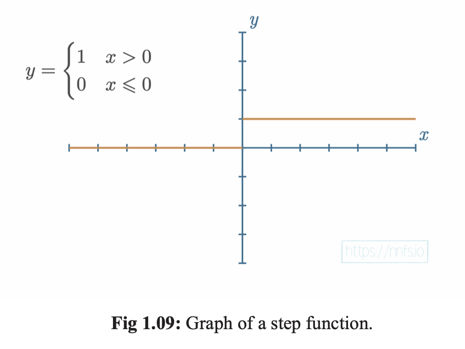

# Chapter 1 : Introducing Neural Networks
Pg 11-24

Sub Topics:
1. A Brief History
2. What is a Neural Network?

# Practice Questions
1. What is a DEEP neural network?
2. What are the main components in a neural network?
3. What is funny about individual neurons in a neural network?
4. What are Dense Layers?
5. What are the trainable factors in a neural network?
6. Describe weights
7. Describe biases
8. Simplified equation for a neuron
9. Why have both weights and biases?
10. What are weights and biases used for?
11. What does a Neural Netowrk equation remind you of?
12. What does the bias do (graphically)?
13. What does the weight do (graphically)?
14. Which activation function is most similar to a biological neuron?
15. What activation function do we tend to use now?
16. What is normalization?
17. What is overfitting?
18. What is generalization?
19. What is a loss function?

# A Brief History

## 1958 - Perceptron

This is the first neural network created by Frank Rosenblatt. It was a single layer neural network that could learn simple binary classification tasks. The perceptron was designed to mimic the way a human brain works. It was capable of learning simple tasks, but it was limited in its capabilities. The perceptron was the first step towards creating more complex neural networks.

```
@article{rosenblatt1958perceptron,
  title={The Perceptron: A Probabilistic Model for Information Storage and Organization in the Brain},
  author={Rosenblatt, Frank},
  journal={Psychological Review},
  volume={65},
  number={6},
  pages={386--408},
  year={1958},
  publisher={American Psychological Association}
}
```


## 1986 - Backpropagation

Geofrrey Hinton and his team published a paper on backpropagation which is the foundation of training neural networks. This paper demonstrated the effectiveness of backpropagation for training multi-layer perceptrons. This paper was the first to show that neural networks could learn internal representations of data in a way that allowed them to generalize to new data. 

```bibtex
@article{rumelhart1986learning,
  title={Learning representations by back-propagating errors},
  author={David Rumelhart, Geoffrey Hinton, and Ronald Williams},
  journal={Nature},
  volume={323},
  number={6088},
  pages={533--536},
  year={1986},
  publisher={Nature Publishing Group}
}
```


## 2012 - AlexNet 

The authors created an Convolutional Neural Network (CNN) that won the ImageNet Large Scale Visual Recognition Challenge (ILSVRC) in 2012. This was the first time a CNN had won the competition, by a staggerring amount. The network was trained on two GPUs for a week and achieved a top-5 error rate of 15.3%, more than 10.8 percentage points lower than the runner up. The model had a mere 60 million parameters and 650,000 neurons. This is a very small model containing only 5 convolution layers and 2 Dense Layers. Utilized Dropout and Data Augmentation to prevent overfitting. Effectively used ReLU activations over the traditional Sigmoid and Tanh activations greatly increasing training speed. 

```bibtex
@inproceedings{krizhevsky2012imagenet,
  title={ImageNet Classification with Deep Convolutional Neural Networks},
  author={Geoffrey Hinton, Alex Krizhevsky, Ilya Sutskever},
  booktitle={Advances in Neural Information Processing Systems},
  volume={25},
  year={2012},
  pages={1097--1105},
  url={https://proceedings.neurips.cc/paper/2012/file/c399862d3b9d6b76c8436e924a68c45b-Paper.pdf}
}
```
## 2017 - Transformer

In this paper, the authors introduced the Transformer model, a model based on self-attention mechanisms. The Transformer model revolutionized natural language processing by enabling parallelization and improving performance on various tasks. The Transformer model has been used in many state-of-the-art models, such as BERT, GPT-2, and T5.


```bibtex
@inproceedings{vaswani2017attention,
  title={Attention is All You Need},
  author={Ashish Vaswani, Noam Shazeer, Niki Parmar, Jakob Uszkoreit, Llion Jones, Aidan N. Gomez, Łukasz Kaiser, and Illia Polosukhin},
  booktitle={Advances in Neural Information Processing Systems},
  volume={30},
  year={2017},
  pages={5998--6008}
}
```

## 2022 - ChatGPT


The authors introduced ChatGPT, a large-scale conversational model that can generate human-like responses to text input. ChatGPT is based on the GPT-3 architecture and has been trained on a large dataset of conversations. ChatGPT has been shown to generate coherent and contextually relevant responses to a wide range of prompts. ChatGPT has been used in a variety of applications, such as chatbots, customer service agents, and virtual assistants.

```bibtex
@misc{chatgpt,
  author = {OpenAI},
  title = {ChatGPT},
  howpublished = {\url{https://openai.com/research/chatgpt}},
  year = {2022},
}
```

# What is a Neural Network?


Artificial Neural Networks are inspired by the human brain. They are a collection of connected neurons that can be trained to perform specific tasks. The human brain is made up of billions of neurons, each connected to thousands of other neurons. The connections between neurons are called synapses. When a neuron receives a signal from another neuron, it processes the signal and sends a signal to other neurons.


An Deep Neural Network (DNN) is composed of two trainable factors: weights and biases. The weights are used to scale the input signal, while the biases are used to shift the output signal. The addition of biases allows the network to learn even when all inputs are zero. This provides each neuron with a degree of freedom. The weights and biases are used to manipulate the input signal to get the desired output signal.

```
output = weight * input + bias
output = activation(output)
```

The equation for a neuron is very similar to the equation of a line: y = mx + b. The weight is the slope of the line, the input is the x value, and the bias is the y-intercept. The activation function is used to introduce non-linearity into the network. Without the activation function, the network would be limited to learning linear functions.


# Answers
1. A Neural Network with 2 or more hidden layers
2. Main Components are: Neurons, Activations, and Interconnections
3. Individual neurons are not very powerful, but when connected in a network they can perform complex tasks
4. Dense Layers are layers where each neuron is connected to every neuron in the previous layer. 
5. Trainable factors are the weights and biases in the network.
6. Weights tells us how of this input to use. Its a trainable factor. Each connection between neurons has a weight associated with it. 
7. Biases are trainable factors that are added to the weighted sum of inputs. Offset the output positively or negatively
8. Output = weight * input + bias
9. Weights are used to scale the input, biases are used to shift the output. The addition of bias allows the network to learn even when all inputs are zero. It provides each neuron with a degree of freedom. 
10. Used to manipulate the input signal to get the desired output signal
11. A Neural Network equation (output = weight * input + bias) reminds me of the equation for a line. y = mx + b.

12. Moves the y-intercept of the line up or down.
13. It can change the slope of the line.

14. Step Function... Meant to mimic brain firing (on or off). Looks like a step when we graph it.

15. We tend to use more informative activation functions like Rectified Linear Unit (ReLU) now.
16. its common to preprocess data to be between 0 or 1 or -1 and 1. This helps the network learn faster and more accurately.
17. When the algorithm only learns to fit the training data but doesn't actually "understand" anything.
18. Learning to fit the data instead of memorizing it
19. A number that indicates how bad the model's prediction was on a single example. Calculating Error.