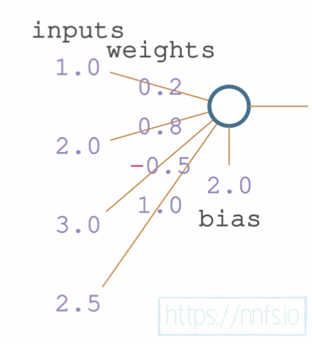
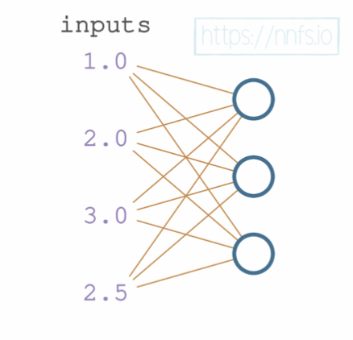

# Chapter 2 : Coding Our First Neurons

Pg 25-58

Subsections:
1. A Single Neuron
2. A Layer of Neurons
3. Tensors, Arrays, and Vectors
4. Dot Product and Vector Addition
5. A Single Neuron with Numpy
6. A Batch of Data
7. Matrix Product
8. Transposition for the Matrix Product
9. A Layer of Neurons and Batch of Data w/ Numpy

TODO:
- README
- python
- jupyter notebook
- Questions and Answers

# Practice Questions
1. Calculate a single neuron output with given inputs, weights, and bias.
```python
inputs = [1.0, 2.0, 3.0, 2.5]
weights = [0.2, 0.8, -0.5, 1.0]
bias = 2.0
```
2. Expand the above example to include a layer of 4 neurons.


# A Single Neuron


```python
inputs = [1.0, 2.0, 3.0, 2.5]
weights = [0.2, 0.8, -0.5, 1.0]
bias = 2.0
```

```python
output = (inputs[0] * weights[0] +
          inputs[1] * weights[1] +
          inputs[2] * weights[2] +
          inputs[3] * weights[3] + bias)
print(f"Output: {output}")
```
```
Output: 4.8
```

# A Layer of Neurons
Every neuron in a layer takes the same inputs but has different weights and biases. The inputs can either be the original inputs or the outputs from the previous layer.


```python
# each neuron gets the same inputs
inputs = [1, 2, 3, 2.5]

# each neuron has its own weights
weights1 = [0.2, 0.8, -0.5, 1.0]
weights2 = [0.5, -0.91, 0.26, -0.5]
weights3 = [-0.26, -0.27, 0.17, 0.87]

# each neuron has its own bias
bias1 = 2
bias2 = 3
bias3 = 0.5

```

```python
outputs = [
    # Neuron 1:
    inputs[0] * weights1[0] +
    inputs[1] * weights1[1] +
    inputs[2] * weights1[2] +
    inputs[3] * weights1[3] + bias1,
    # Neuron 2:
    inputs[0] * weights2[0] +
    inputs[1] * weights2[1] +
    inputs[2] * weights2[2] + 
    inputs[3] * weights2[3] + bias2,
    # Neuron 3:
    inputs[0] * weights3[0] + 
    inputs[1] * weights3[1] + 
    inputs[2] * weights3[2] + 
    inputs[3] * weights3[3] + bias3]

print(f"Output: {outputs}")
```

```
Output: [4.8, 1.21, 2.385]
```


# Tensors, Arrays, and Vectors

## Vector
A Vector is a 1D array of numbers. Known as a list in Python. In Numpy its simply a 1 Dimensional array. Unlike Physics where a vector has both magnitude and direction, in ML, a vector is just a list of numbers.

```python 
import numpy as np

# Create a vector
vector = np.array([1, 2, 3, 4, 5])
```

## Matrix
A Matrix is a 2D array of numbers. In Python, it is a list of lists. In Numpy, it is a 2D array. Always 2-dimensional array. Rectangular array (rows and columns).

```python
import numpy as np

# Create a matrix using Numpy
matrix = np.array([[1, 2, 3], [4, 5, 6]])
```


## Array
An ordered homologous container for numbers. In Python, it is a list of lists. In Numpy, it is a multi-dimensional array.


```python
import numpy as np

# Create a 2D array using Numpy
array = np.array([[1, 2, 3], [4, 5, 6]])

# List of Lists
array = [[1, 2, 3], [4, 5, 6]]

```

## Tensor
A tensor is a container for numbers. It can be a scalar, vector, or a matrix. In Numpy, a tensor is a multi-dimensional array.

```python
import numpy as np

# 0D Tensor - Scalar
tensor = np.array(4)

# 1D Tensor - Vector
tensor = np.array([1, 2, 3, 4, 5])

# 2D Tensor - Matrix
tensor = np.array([[1, 2], [3, 4]])

# 3D Tensor - Array
tensor = np.array([[[1, 2], [3, 4]], [[5, 6], [7, 8]]])

```

# Dot Product and Vector Addition
There are two ways to perform vector multiplication: dot product and cross product.

## Dot Product
Mathmatical operation that takes two EQUAL length vectors and returns a single number (scalar). 

```python
a = [1, 2, 3]
b = [2, 3, 4]

dot_product = a[0] * b[0] + a[1] * b[1] + a[2] * b[2]
```
```
[1]     |2|
[2]  *  |3|  = [20]
[3]     |4|

```


```
20
```

## Vector Addition
Mathmatical operation that adds two vectors of same size. The resulting size is the same as the input vectors.

```python
a = [1, 3, 5]
b = [2, 4, 6]

a + b = [1 + 2, 3 + 4, 5 + 6]
```
```
[3, 7, 11]
```

# A Single Neuron with Numpy
Utilizing Numpy significantly simplifies the process of calculating the output of a single neuron.

```python
import numpy as np

inputs = [1.0, 2.0, 3.0, 2.5]
weights = [0.2, 0.8, -0.5, 1.0]
bias = 2.0

outputs = np.dot(weights, inputs) + bias
print(f"Single Neuron Output: {outputs}")
```

```
Single Neuron Output: 4.8
```

# A Layer of Neurons with Numpy
The same simple command (np.dot) can be used to calculate the output of a layer of neurons.

```python
import numpy as np

inputs = [1.0, 2.0, 3.0, 2.5]
weights = [[0.2, 0.8, -0.5, 1.0],
           [0.5, -0.91, 0.26, -0.5],
           [-0.26, -0.27, 0.17, 0.87]]
biases = [2.0, 3.0, 0.5]

outputs = np.dot(weights, inputs) + biases
print(f"Layer of Neurons Output: {outputs}")

```

```
Layer of Neurons Output: [4.8, 1.21, 2.385]
```


# A Batch of Data

Created using Giphy website. Giphy only really works in Chrome


# Matrix Product

# Transposition for the Matrix Product

# A Layer of Neurons and Batch of Data w/ Numpy

# YouTube Series
