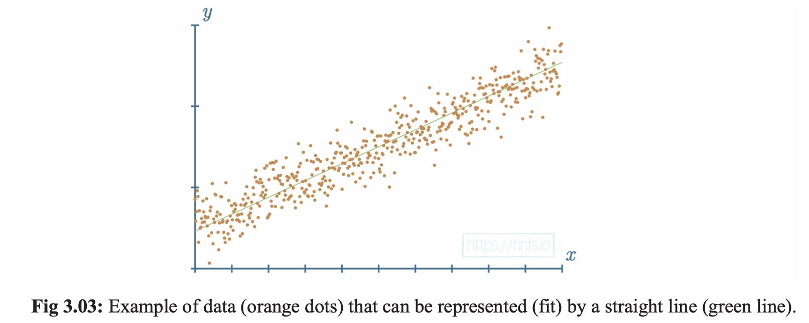
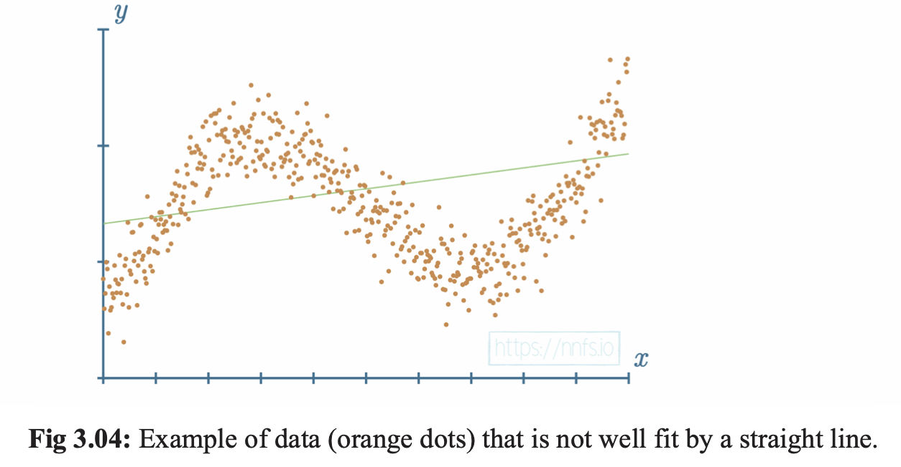
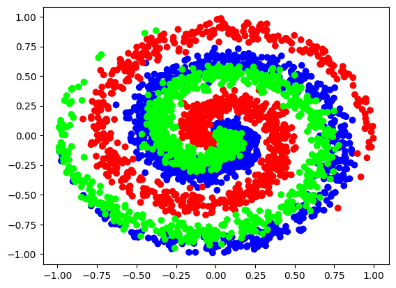

# Chapter 3 : Adding Layers

Pg 59-71

Sections:
- Introduction
- Training Data
- Dense Layer Class
- Full Code Up to this point

TODO:
- README
- python
- jupyter notebook
- Questions and Answers

# Introduction

### Adding Hidden Layers
```python
# 1st Layer - input layer
inputs = [[1, 2, 3, 2.5],
          [2.0, 5.0, -1.0, 2.0],
          [-1.5, 2.7, 3.3, -0.8]]

weights = [[0.2, 0.8, -0.5, 1.0],
            [0.5, -0.91, 0.26, -0.5],
            [-0.26, -0.27, 0.17, 0.87]]
biases = [2, 3, 0.5]

# hidden layer
weights2 = [[0.1, -0.14, 0.5],
            [-0.5, 0.12, -0.33],
            [-0.44, 0.73, -0.13]]
biases2 = [-1, 2, -0.5]
```


```python
# Layer 1 outputs
layer1_outputs = np.dot(np.array(inputs), np.array(weights).T) + biases
```

```
[[ 4.79999995  1.21000004  2.38499999]
 [ 8.9000001  -1.80999994  0.19999999]
 [ 1.41000003  1.051       0.02599999]]
```

```python
# Layer 2 outputs
layer2_outputs = np.dot(layer1_outputs, np.array(weights2).T) + biases2
```

```
[[ 0.5031  -1.04185 -2.03875]
 [ 0.2434  -2.7332  -5.7633 ]
 [-0.99314  1.41254 -0.35655]]
```

# Training Data


### Linear Data
Data that can be represented by a straight line. This can be accomplished using very simple machine learning models.


### Non-Linear Data
Data that cannot be represented by a straight line. This requires more complex models to represent the data.

## NNFS Library
Created to make simple dataset creation.

```python
import nnfs
from nnfs.datasets import spiral_data

nnfs.init()

X, y = spiral_data(samples=100, classes=3)

plt.scatter(X[:, 0], X[:, 1], c=y, cmap='brg')
plt.show()
```


# Dense Layer Class

```python
# dense layer
class dense_layer:

    # layer initialization
    def __init__(self, n_inputs, n_neurons):
        # initialize weights and biases
        self.weights = 0.01 * np.random.randn(n_inputs, n_neurons)
        self.biases = np.zeros((1, n_neurons))

    # forward pass
    def forward(self, inputs):
        # calculate output values from inputs, weights, and biases 
        self.output = np.dot(inputs, self.weights) + self.biases
```

# Full Code Up to this point

```python
import numpy as np
import nnfs
from nnfs.datasets import spiral_data

nnfs.init()

# dense layer
class Layer_Dense:

    # layer initialization
    def __init__(self, n_inputs, n_neurons):
        # initialize weights and biases
        self.weights = 0.01 * np.random.randn(n_inputs, n_neurons)
        self.biases = np.zeros((1, n_neurons))

    # forward pass
    def forward(self, inputs):
        # calculate output values from inputs, weights, and biases 
        self.output = np.dot(inputs, self.weights) + self.biases

# create dataset
X, y = spiral_data(samples=100, classes=3)

# create dense layer with 2 input features and 3 output values
dense1 = Layer_Dense(2,3)

# perform forward pass of training data through this layer
dense1.forward(X)

# see output of first few samples
print(dense1.output[:5])
```

```
[[ 0.0000000e+00  0.0000000e+00  0.0000000e+00]
 [-1.0475188e-04  1.1395361e-04 -4.7983500e-05]
 [-2.7414842e-04  3.1729150e-04 -8.6921798e-05]
 [-4.2188365e-04  5.2666257e-04 -5.5912682e-05]
 [-5.7707680e-04  7.1401405e-04 -8.9430439e-05]]
```