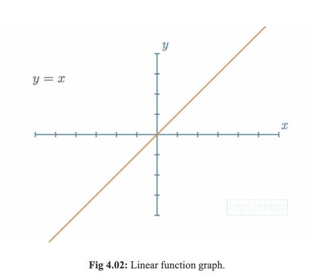

# Chapter 4 : Activation Functions

Pg 72 - 110

## Table of Contents
Subsections:
1. The Step Activation Function
2. The Linear Activation Function
3. The Sigmoid Activation Function
4. The Rectified Linear Activation Function
5. Why Use Activation Functions?
6. Linear Activation in the Hidden Layers
7. ReLU Activation in a Pair of Neurons
8. ReLU Activation in the Hidden Layers
9. ReLU Activation Function Code
10. The Softmax Activation Function
11. Full Code Up to This Point


# Introduction


Activation Functions are applied to the output of the neuron which modified the output. The non-linearity of the activation function themselves allow the hidden layers to map non-linear functions. Hidden layers by themselves are linear functions (inputs x weights + bias) and cannot produce non-linear outputs. 

Two types of activation functions are used in neural networks. The first are ones used for hidden layers and the second are used for output layers. Generally, the activation functions for hidden neurons are the same for all the neurons in the hidden layer.


# The Step Activation Function


```python
if weights * inputs + bias > 0:
    output = 1
else:
    output = 0
```
The purpose of an activation function is to mimic a neuron "firing" or "not firing". The most common activation to this is the step function. Fires (outputs 1) if : weight * input + bias > 0. Rarely used in practice because its not differentiable, can't figure out how it changes(so cant compute the gradient). Historically though it was used in hidden layers.
```
Main Problem: NOT VERY INFORMATIVE (TO OPTIMIZER)

Does not give much information on the impact weights and biases have on the ouptut. Doesn't tell you how close you are to activating (what if you were only .0000001 away from activating or 100000000 away from activating)
```

# The Linear Activation Function



Just a simple equation of a line where the output always equals the input. This is also not used in practice because it doesn't add any non-linearity to the model. The hidden layers would just be a linear combination of the inputs. Always appears as straight lines in the graph. 

```
"Only liberals would use this actiation function"
```

# The Sigmoid Activation Function


A signmoid is a S-shaped curve that ranges from 0 to 1. Came after Step Function as a more granular and informative activation function. This is a relatively smooth function that is differentiable at all points. Used in output layers of binary classification problems. Also used in hidden layers of neural networks. Eventually it was replaced by ReLU (Rectified Linear Unit) because it was computationally expensive. 

```python
import numpy as np

def sigmoid_act(x):
    return 1 / (1 + np.exp(-x))
```

# The Rectified Linear Activation Function


The most popular activation function in deep learning. It is a piecewise function that outputs 0 if the input is less than 0 and outputs the input if the input is greater than 0. It is computationally efficient and allows the model to learn faster. Introduces non-linearity to the model.

```
REASON ITS SO INTERESTING:

Its extremely close to being a linear activation function
```


```python
def relu(x):
    return np.maximum(0, x)
```


# Why Use Activation Functions?

## Linear Problems


These are very simple problems found in life. For example, the price of some number of shirts is linearly related to the number of shirts. The image above shows a sine wave and how a linear activation function would not be able to solve this problem.

## NonLinear Problems


These are more complex problems that are not linearly related. For example, the price of a house is not linearly related to the number of rooms in the house. Main attraction of neural networks is that they can solve non-linear problems. Another example is the SINE wave. A linear model would not be able to solve this problem.

# Linear Activation in the Hidden Layers


The reason we can't use linear activation functions in hidden layer neurons is because no matter what weights and biases you use the output will always be perfectly linear (y=x). 


# ReLU Activation in a Pair of Neurons


# ReLU Activation in the Hidden Layers


# ReLU Activation Function Code

```python
import numpy as np

inputs = [0, 2, -1, 3.3, -2.7, 1.1, 2.2, -100]
output = np.maximum(0, inputs)
print(output)
```
```
[0. 2. 0. 3.3 0. 1.1 2.2 0. ]
```

What this activation function does to the output is essentially set all the negative values to 0. 

```python
# ReLU Activation Class

class Activation_ReLU:
    # forward pass
    def forward(self, inputs):
        # calculate output values from inputs
        self.output = np.maximum(0, inputs)
```

# The Softmax Activation Function


Equation: 

```
f(x) = e^x / Σe^x

e - Euler's number (2.71828)
```

An activation function that is used in the output layer of a neural network for multi-class classification problems. It is a generalization of the sigmoid function. It takes in a vector of numbers and outputs a vector of the same length. The output is a probability distribution that sums to 1. 

```python
# softmax activation
class Activation_Softmax:
    # forward pass
    def forward(self, inputs):
        # get unnormalized probabilities - e^x
        exp_values = np.exp(inputs - np.max(inputs, axis=1, keeodims=True))
        # normalize them for each sample - e^x / sum(e^x)
        probabilities = exp_values / np.sum(exp_values, axis=1, keepdims=True)
        self.output = probabilities
```

```python
softmax = Activation_Softmax()

softmax.forward([[1, 2, 3]])
print(f"Softmax Output: {softmax.output}")
```

```
Softmax Output: [[0.09003057 0.24472847 0.66524096]]
```

# Full Code Up to This Point

```python
import numpy as np
import nnfs
from nnfs.datasets import spiral_data

nnfs.init()

# dense layer
class Layer_Dense:
    # layer initialization
    def __init__(self, n_inputs, n_neurons):
        # initialize weights and biases
        self.weights = 0.01 * np.random.randn(n_inputs, n_neurons)
        self.biases = np.zeros((1, n_neurons))

    # forward pass
    def forward(self, inputs):
        # calculate output values from inputs, weights, and biases
        self.output = np.dot(inputs, self.weights) + self.biases
    
class Activation_ReLU:
    # forward pass
    def forward(self, inputs):
        # calculate output values from inputs
        self.output = np.maximum(0, inputs)

class Activation_Softmax:
    # forward pass
    def forward(self, inputs):
        # get unnormalized probabilities
        exp_values = np.exp(inputs - np.max(inputs, axis=1, keepdims=True))
        # normalize them for each sample
        probabilities = exp_values / np.sum(exp_values, axis=1, keepdims=True)
        self.output = probabilities

# create dataset
X, y = spiral_data(samples=100, classes=3)

# create dense layer with 2 input features and 3 output values
dense1 = Layer_Dense(2, 3)

# create ReLU activation (to be used with Dense Layer)
activation1 = Activation_ReLU()

# create second Dense layer with 3 input features (as we take output of previous layer here) and 3 output values
dense2 = Layer_Dense(3, 3)

# create Softmax activation (to be used with Dense Layer)
activation2 = Activation_Softmax()

# make a forward pass of our training data through this layer
dense1.forward(X)

# make a forward pass through activation function
# it takes the output of first dense layer here
activation1.forward(dense1.output)

# make a forward pass through second Dense layer
# it takes outputs of activation function of first layer as inputs
dense2.forward(activation1.output)

# make a forward pass through activation function
# it takes the output of second dense layer here
activation2.forward(dense2.output)

# lets see output of the first few samples:
#print(f"Output (No Activation): \n{dense2.output[:5]}")
print(f"Output (Softmax): \n{activation2.output[:5]}")

```
```
Output (Softmax): 
[[0.33333334 0.33333334 0.33333334]
 [0.33333316 0.3333332  0.33333364]
 [0.33333287 0.3333329  0.33333418]
 [0.3333326  0.33333263 0.33333477]
 [0.33333233 0.3333324  0.33333528]]
```


# Cheat Sheet
## Sigmoid Activation Function
```
Formula: ​f(x) = 1 / (1 + e^-x)

Range: Outputs a value between 0 and 1.

Use Case: Commonly used in binary classification problems, typically in the output layer of a neural network where each output neuron corresponds to one class.
```
## ReLU Activation Function
```
Formula: f(x) = max(0, x)

Range: Outputs a value between 0 and infinity.

Use Case: Commonly used in hidden layers of neural networks. It is computationally efficient and allows the model to learn faster.
```
## Softmax Activation Function
```
Formula: f(x) = e^xi / Σe^xi

Range: Outputs a value between 0 and 1.

Use Case: Commonly used in the output layer of a neural network for multi-class classification problems. It is a generalization of the sigmoid function.
```

# Questions
1. Does the step-function introduce non-linearity to the model?
2. How can we make a Rectified Linear Activation Function activate earlier (page 82)?

# Answers

2. We can do this by adding more bias to the neuron. This will make the neuron activate earlier.