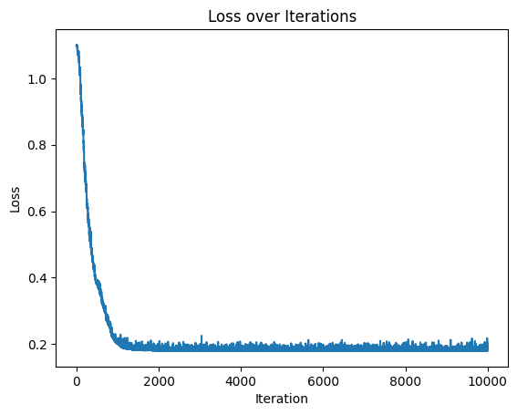
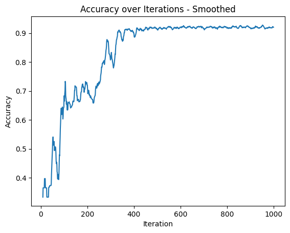

# Chapter 6 : Introducing Optimization

Pg.131-138

# Introduction

Now that we can calculate loss we need to determine how to adjust the weights and biases to decrease the loss. This is where optimization comes in. Optimization is the process of adjusting the weights and biases to minimize the loss.

## Approach #1 - Random Search

```python
# helper variables - track best loss and associated weights/biases
lowest_loss = 9999999
best_dense1_weights = dense1.weights.copy()
best_dense1_biases = dense1.biases.copy()
best_dense2_weights = dense2.weights.copy()
best_dense2_biases = dense2.biases.copy()

for iteration in range(10000):
    
    # generate a new set of weights and biases
    dense1.weights = 0.05 * np.random.randn(2, 3)
    dense1.biases = 0.05 * np.random.randn(1, 3)
    dense2.weights = 0.05 * np.random.randn(3, 3)
    dense2.biases = 0.05 * np.random.randn(1, 3)
    
    # perform a forward pass of the training data through this layer
    dense1.forward(X)
    activation1.forward(dense1.output)
    dense2.forward(activation1.output)
    activation2.forward(dense2.output)
    
    # calculate the loss from output of activation2
    loss = loss_function.calculate(activation2.output, y)
    
    # calculate accuracy
    predictions = np.argmax(activation2.output, axis=1)
    accuracy = np.mean(predictions == y)
    
    # if loss is smaller - print and save weights and biases aside
    if loss < lowest_loss:
        print(f'New set of weights found, iteration: {iteration}, loss: {loss}, accuracy: {accuracy}')
        best_dense1_weights = dense1.weights.copy()
        best_dense1_biases = dense1.biases.copy()
        best_dense2_weights = dense2.weights.copy()
        best_dense2_biases = dense2.biases.copy()
        lowest_loss = loss
```

```
New set of weights found, iteration: 0, loss: 1.098656415939331, accuracy: 0.3333333333333333
New set of weights found, iteration: 3, loss: 1.0981379747390747, accuracy: 0.3333333333333333
New set of weights found, iteration: 117, loss: 1.0980114936828613, accuracy: 0.3333333333333333
New set of weights found, iteration: 124, loss: 1.0977516174316406, accuracy: 0.6
New set of weights found, iteration: 165, loss: 1.0975710153579712, accuracy: 0.3333333333333333
New set of weights found, iteration: 552, loss: 1.0974693298339844, accuracy: 0.34
New set of weights found, iteration: 778, loss: 1.0968257188796997, accuracy: 0.3333333333333333
New set of weights found, iteration: 4307, loss: 1.0965533256530762, accuracy: 0.3333333333333333
New set of weights found, iteration: 4615, loss: 1.096449851989746, accuracy: 0.3333333333333333
New set of weights found, iteration: 9450, loss: 1.096429467201233, accuracy: 0.3333333333333333
```

## Approach #2 - Increase Best Weights/Biases By Fraction

```python
dense1.weights += 0.05 * np.random.randn(2, 3)
dense1.biases += 0.05 * np.random.randn(1, 3)
dense2.weights += 0.05 * np.random.randn(3, 3)
dense2.biases += 0.05 * np.random.randn(1, 3)
```
# Full Code up to this point

```python
# Previous code
import numpy as np
import nnfs
from nnfs.datasets import spiral_data

nnfs.init()

# dense layer
class Layer_Dense:

    # layer initialization
    def __init__(self, n_inputs, n_neurons):
        # initialize weights and biases
        self.weights = 0.01 * np.random.randn(n_inputs, n_neurons)
        self.biases = np.zeros((1, n_neurons))
    
    # forward pass
    def forward(self, inputs):
        # calculate output values from inputs, weights, and biases
        self.output = np.dot(inputs, self.weights) + self.biases

# ReLU activation
class Activation_ReLU:
    
        # forward pass
        def forward(self, inputs):
            # calculate output values from inputs
            self.output = np.maximum(0, inputs)

# softmax activation
class Activation_Softmax:
         
        # forward pass
        def forward(self, inputs):
    
            # get unnormalized probabilities
            exp_values = np.exp(inputs - np.max(inputs, axis=1, keepdims=True))
    
            # normalize them for each sample
            probabilities = exp_values / np.sum(exp_values, axis=1, keepdims=True)
    
            self.output = probabilities

# common loss class
class Loss:
         
        # calculates data and regularization losses
        # given model output and ground truth values
        def calculate(self, output, y):
    
            # calculate sample losses
            sample_losses = self.forward(output, y)
            #print("Sample Losses: ", sample_losses)
    
            # calculate mean loss
            data_loss = np.mean(sample_losses)
            #print(f"Data Loss: {data_loss}")
    
            # return loss
            return data_loss
        
# cross-entropy loss
class Loss_CategoricalCrossentropy(Loss):
     
     # forward pass
    def forward(self, y_pred, y_true):
         
        # number of samples in a batch
        samples = len(y_pred)
         
        # clip data to prevent division by 0
        # clip both sides to not drag mean towards any value
        y_pred_clipped = np.clip(y_pred, 1e-7, 1 - 1e-7)
         
        # probabilities for target values
        if len(y_true.shape) == 1:
            correct_confidences = y_pred_clipped[range(samples), y_true]
             
        elif len(y_true.shape) == 2:
            correct_confidences = np.sum(y_pred_clipped * y_true, axis=1)
         
        # losses
        negative_log_likelihoods = -np.log(correct_confidences)
        return negative_log_likelihoods


################### Chapter 6 Code ###################

# create dataset
X, y = vertical_data(samples=100, classes=3)

# create model
dense1 = Layer_Dense(2, 3)
activation1 = Activation_ReLU()
dense2 = Layer_Dense(3, 3)
activation2 = Activation_Softmax()

# create loss function
loss_function = Loss_CategoricalCrossentropy()

# helper variables
lowest_loss = 9999999
best_dense1_weights = dense1.weights.copy()
best_dense1_biases = dense1.biases.copy()
best_dense2_weights = dense2.weights.copy()
best_dense2_biases = dense2.biases.copy()

loss_values = []
acc_values = []

for iteration in range(1000):

    # update weights iwth small random values
    dense1.weights += 0.05 * np.random.randn(2, 3)
    dense1.biases += 0.05 * np.random.randn(1, 3)
    dense2.weights += 0.05 * np.random.randn(3, 3)
    dense2.biases += 0.05 * np.random.randn(1, 3)

    # perform a forward pass of the training data through this layer
    dense1.forward(X)
    activation1.forward(dense1.output)
    dense2.forward(activation1.output)
    activation2.forward(dense2.output)

    # perform a forward pass through activation function
    # it takes the output of second dense layer here and returns loss
    loss = loss_function.calculate(activation2.output, y)
    
    # Store the loss value
    loss_values.append(loss)
    
    # calculate accuracy from output of activation2 and targets
    predictions = np.argmax(activation2.output, axis=1)
    accuracy = np.mean(predictions == y)
    acc_values.append(accuracy)

    # if loss is smaller - print and save weights and biases aside
    if loss < lowest_loss:
        print(f'New set of weights found, iteration: {iteration}, loss: {loss}, accuracy: {np.mean(predictions == y)}')
        best_dense1_weights = dense1.weights.copy()
        best_dense1_biases = dense1.biases.copy()
        best_dense2_weights = dense2.weights.copy()
        best_dense2_biases = dense2.biases.copy()
        lowest_loss = loss
    # revert weights and biases
    else:
        dense1.weights = best_dense1_weights.copy()
        dense1.biases = best_dense1_biases.copy()
        dense2.weights = best_dense2_weights.copy()
        dense2.biases = best_dense2_biases.copy()
```



