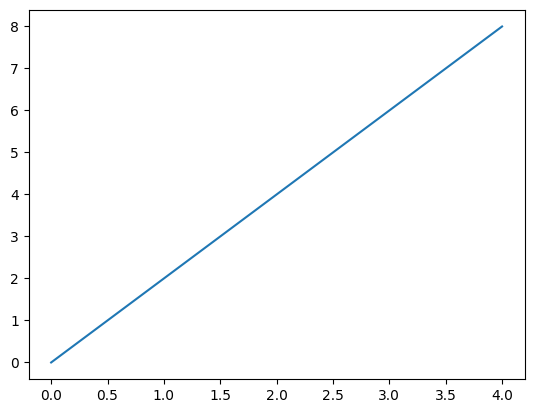
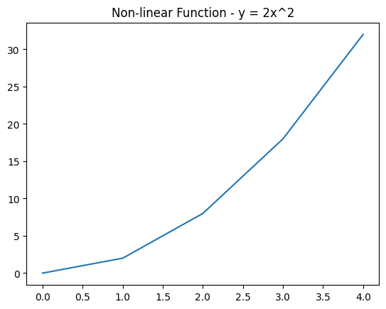
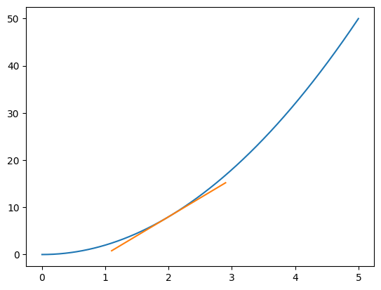
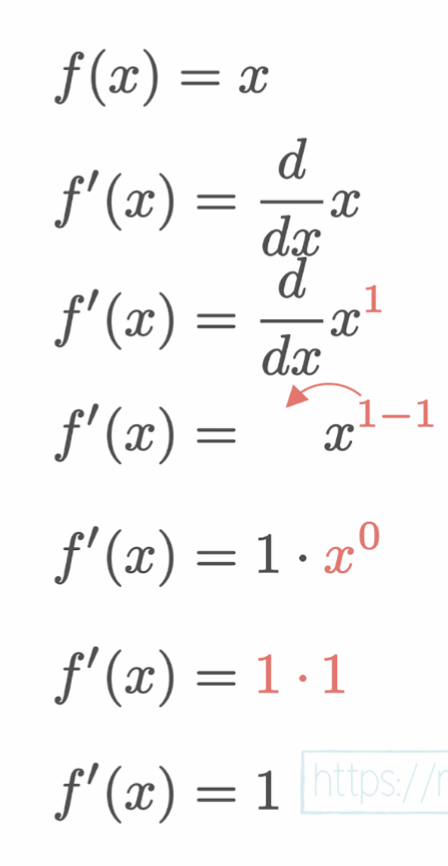
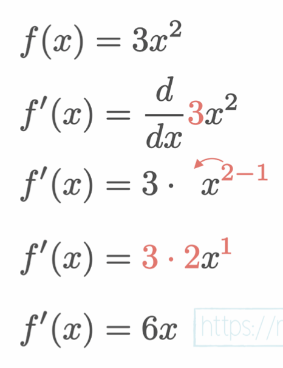
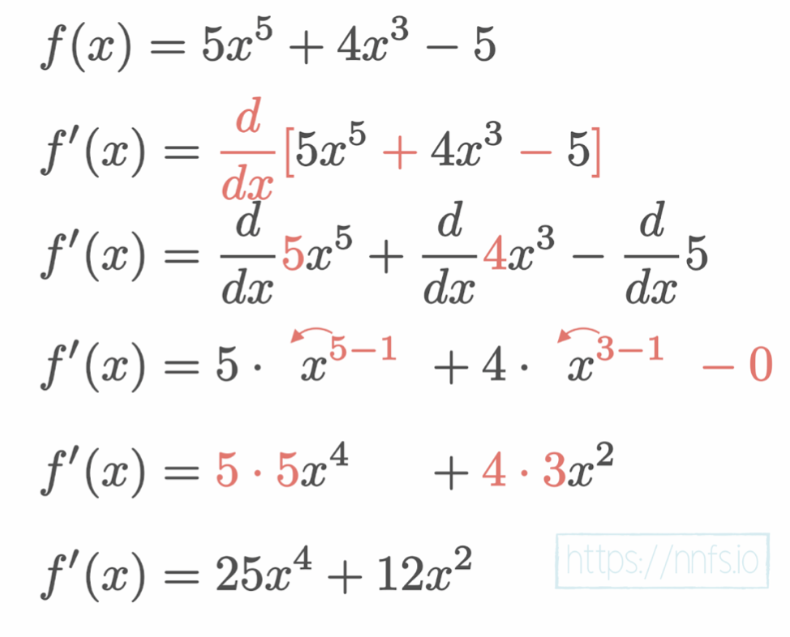
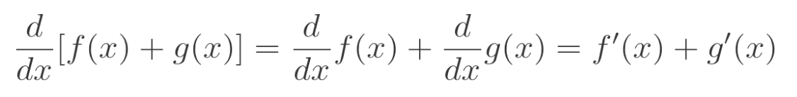
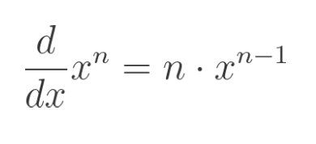

# Chapter 7 : Derivatives

Pg.139-165

## Subsections
1. Introduction
2. The Impact of a Parameter on the Output
3. The Slope
4. The Numerical Derivative
5. The Analytical Derivative
6. Summary

# Introduction

Each Weight and Bias have different degrees of influence on the loss. Our goal is to decrease loss and we do this by using gradient descent. 
- Gradient = a result of a calculation of partial derivatives
- Derivatives = calculated from functions taking single parameters

# The Impact of a Parameter on the Output

```python
import matplotlib.pyplot as plt
import numpy as np

# Simple Function : y = 2x
def f(x):
    return 2 * x

x = np.array(range(5))
y = f(x)

print(f"X: {x}")
print(f"Y: {y}")

plt.plot(x, y)
plt.show()
```
```
X: [0 1 2 3 4]
Y: [0 2 4 6 8]
```


# The Slope

The slope of a function is the rate of change of the function. The slope of a function is the derivative of the function. 

```
Slope = (y2 - y1) / (x2 - x1)
```

## Linear Functions

Say for example the slope of a linear function is 2. We could say the measure of the impact that X has on Y is 2.

## Non-Linear Functions

Non-linear functions have a slope that changes depending on the value of X. So the slope will be different at different points. 



# The Numerical Derivative

Numerical Derivatives are approximations of the derivative of a function. They calculate the slope of tangent line using two infinitely close points. The closer the points the more accurate the derivative. 


```python
import matplotlib.pyplot as plt
import numpy as np

def f(x):
    return 2*x**2

# np.arange(start, stop, step) to give us smoother line
x = np.arange(0, 5, 0.001)
y = f(x)
plt.plot(x, y)

# the point and the close enough point
p2_delta = 0.0001
x1 = 2
x2 = x1 + p2_delta

y1 = f(x1) # result at derivation point
y2 = f(x2) # result at other, close point

print((x1, y1), (x2, y2))

# derivative approximation and y-intercept for the tangent line
approximate_derivative = (y2 - y1) / (x2 - x1)
b = y2 - approximate_derivative * x2

# we put the tangent line calculation into a function so we can call it multiple times for different values of x
# approximate derivative and b are constant for given function
# thus calculated once above this function
def tangent_line(x):
    return approximate_derivative * x + b

# plotting the tangent line
# +/- 0.9 to draw the tangent line on our graph
# then we calculate the y for given x using the tangent line function
# matplotlib will draw the line for us through these points
to_plot = [x1 - 0.9, x1, x1 + 0.9]
plt.plot(to_plot, [tangent_line(i) for i in to_plot])

print(f"Approximate derivative for f(x) where x = {x1} is {approximate_derivative}")

plt.show()
```

```
(2, 8) (2.0001, 8.000800020000002)
Approximate derivative for f(x) where x = 2 is 8.000199999998785
```


# The Analytical Derivative

Analytical Derivatives are the exact derivative of a function. They are calculated using the rules of differentiation. These are the ones we actually use in our neural networks. Unlike numerical derivatives, analytical derivatives are exact and do not require approximation. They vary in complexity depending on the function.

Steps to compute derivative:
1. Split into simple elemental functions
2. Find the derivative of each elemental function
3. Apply the chain rule to get full derivative

## Derivative of Linear Function

```
f(x) = mx
f'(x) = m
```


# Derivative of Quadratic Function



# Derivative of Multiple Functions




# Summary

## Derivative of Constant

```
Derivative of a constant is always 0.

d/dx 1 = 0
d/dx m = 0
```

## Derivative of X

```
Derivative of x equals 1.

d/dx x = 1
```

## Derivative of Linear Function

```
Derivative of Linear Function equals slope (m).

d/dx mx + b = m
```

## Derivative of Sume of Functions

```
Derivative of sum of functions equals sum of derivatives.
```


## Derivative of Exponentiation

