# Chapter 7 : Gradients, Partial Derivatives, and the Chain Rule

Pg.166-179

## Subsections
1. Introduction
2. The Partial Derivative
3. The Partial Derivative of a Sum
4. The Partial Derivative of Multiplication
5. The Partial Derivative of Max
6. The Gradient
7. The Chain Rule
8. Summary

# Introduction

The derivatives we have solved so far have been with respect to a single variable. However, in the context of neural networks, we will often have to deal with multiple variables. This is where the concept of partial derivatives comes in.

To learn the impact of all inputs, weights, biases, and neuron output we need to calculate the derivative f each operation performed during forward pass. To do this we will use the chain rule.

# The Partial Derivative

Partial derivatives measure how much impact a single input has on the output of a function. The partial derivative of a function with respect to a single input is calculated by holding all other inputs constant. 
- Partial Derivative : single equation
- Gradient : the full multivariate functions derivative containing all partial derivatives. Vector of the size of inputs containing partial derivative solutions with respect to each of the inputs. 

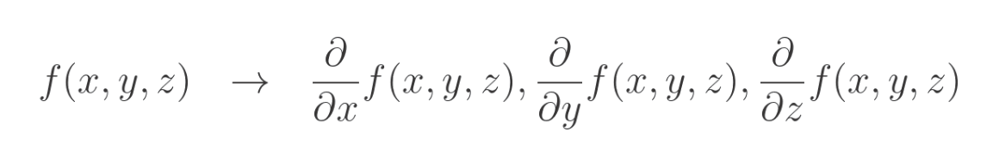

Notation is different for book, using Euler Notation. Essentially it replaces the differential operation
```
d -> ∂
```

```
Summary: A partial derivative is a situation where we try to find the impact of the given input to the output while treating all of the other inputs as constants. 
```


# The Partial Derivative of a Sum

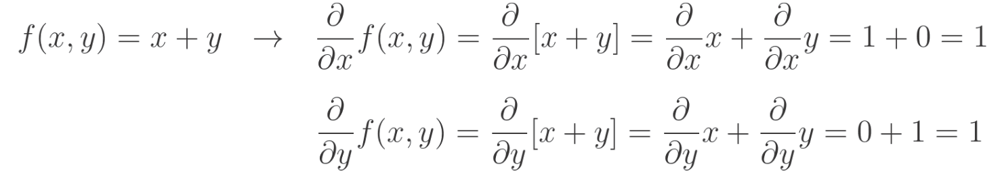

## First Equation
Derivative of X with respsect to x equals 1. Derivative of Y with respect to x ALWAYS equals 0.

## Another Example

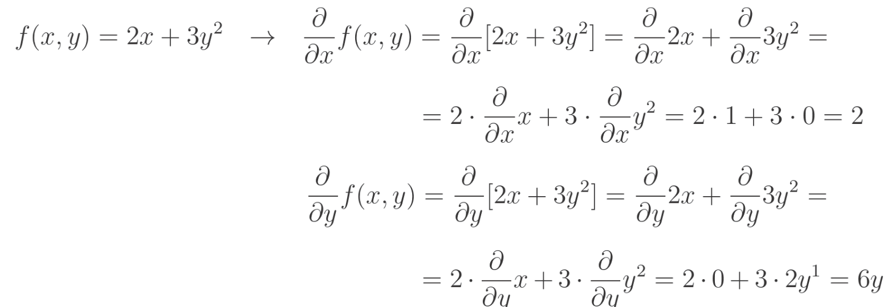

As you can see we are constantly applying the same rules over and over again.

# The Partial Derivative of Multiplication

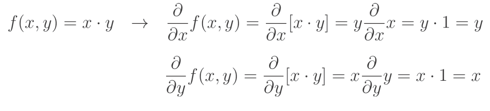

We treat other variables as constants and move them outside of the derivative.

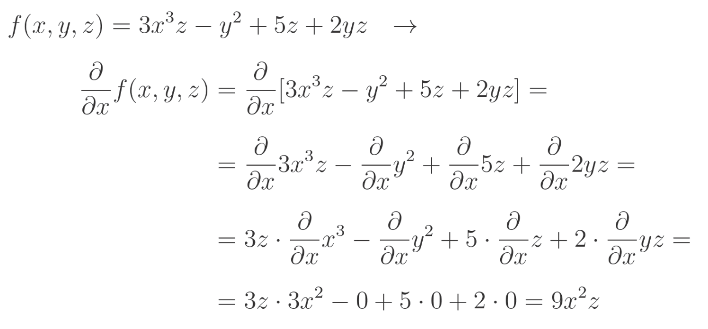

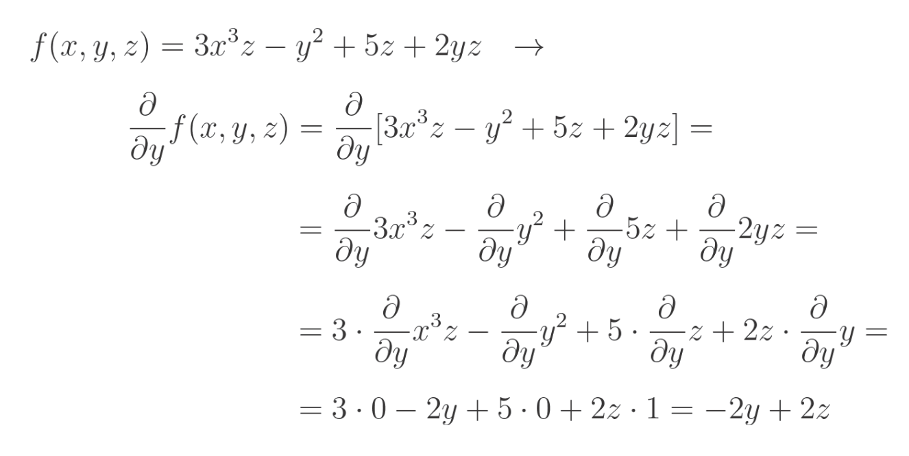

The only new operation here is moving variables other than the one that we derive with respect to, outside of the derivative.

# The Partial Derivative of Max

## Max Function

Takes two numbers and returns the larger one. 
```python 
max(3,5) --> 5
```
## Derivative of Max Function
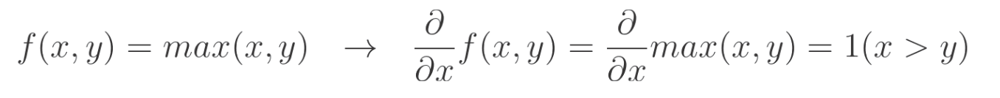

Lets say we have max(x, y). 
```
If x > y, max(x, y) returns x
If y > x, max(x, y) returns y
```
## Special Notation
```
1(x > y)
```
This means the derivative is 1 if x is greateer than y, otherwise, its 0.

## Special Case : ReLU
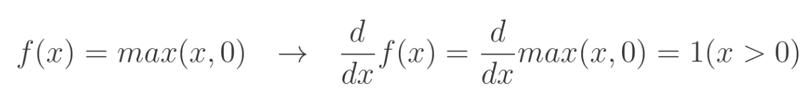
The ReLU function is max(x, 0). It returns x if x is positive, otherwise it returns 0. The derivative of ReLU with respect to x is:
- 1 if x is greater than 0
- 0 if x is less than or equal to 0


# The Gradient

```
Gradient : A vector composed of all of the partial derivatives of a function, calculated with respect to each input variable.
```

Earlier example of partial derivatives of sum operation we already calculated.

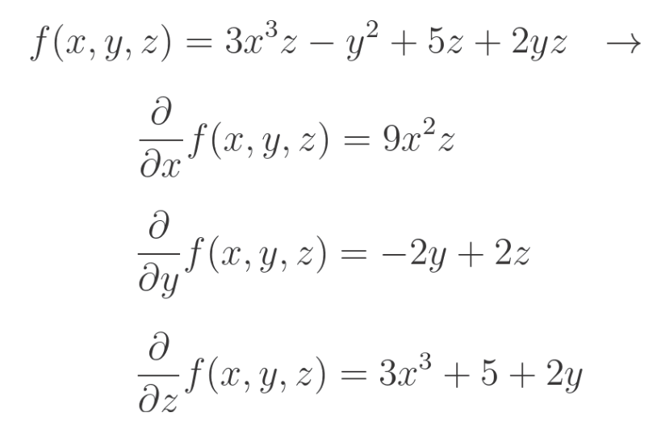

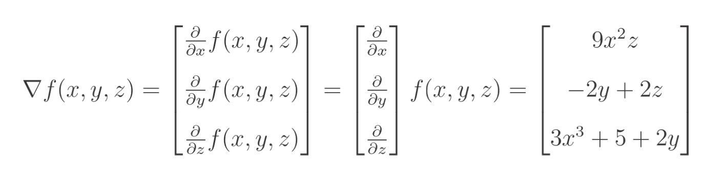

We use a triangle to denote a gradient.

We use the derivatives of single parameter functions and the gradients of multivariate function to perform gradient descent using the chain rule. In other words, to perform the backward pass. 

# The Chain Rule

The chain rule helps us find the derivative of complex, nested functions by breaking them down into simpler parts. In neural networks, it helps us understanding hwo changing inputs (weights) affects final output (loss). The chain rule states that the derivative of a composed function is the product of the derivatives of the individual functions. 

## Example

```
h(x) = 3(2x^2)^5
```

```
Break this down:
g(x) = 2x^2
f(y) = 3y^5 
```
```
So, h(x) = f(g(x))
```

### Step 1 - Find Derivatives
First find derivative of outer function f(y) with respect to y:
```
d/dy [3y^5] = 15y^4
```
Then, find the derivative of the inner function g(x) with respect to x:
```
d/dx [2x^2] = 4x
```

# Step 2 - Apply Chain Rule
Multiply these derivitaives together, substituting y = 2x^2 back in:
```
dh/dx = 15(2x^2)^4 * 4x
```
Simplify the expression:
```
dh/dx = 15 * 16x^8 * 4x = 960x^9
```


# Summary

## Partial Derivative of Sum

The partial derivative of the sum with respect to any input equals 1

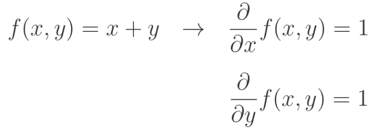

## Partial Derivative of Multiplication

The partial derivative of the multiplication operation with 2 inputs, with respect to any input, equals the other input.

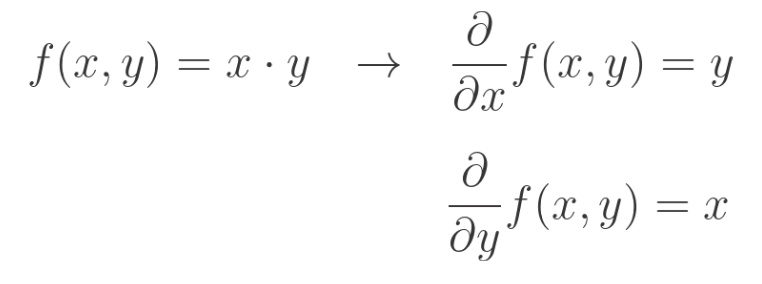

## Partial Derivative of Max Function

The partial derivative of the max function of 2 variables with respect to any of them is 1 if this variable is the biggest and 0 otherwise. An example of x.

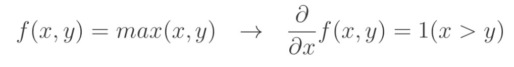

The derivative of the max function of a single variable and 0 equals 1 if the variable is greater than 0 and 0 otherwise.

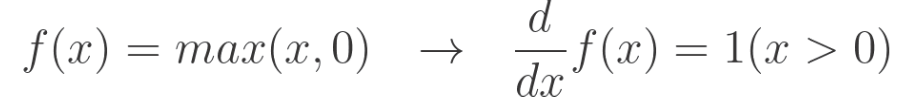

## Derivative of Chained Functions

The deriviative of chained functions equals the product of the partial derivatives of the subsequent functions:

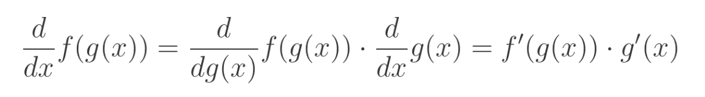

The same applies to the partial derivatives.

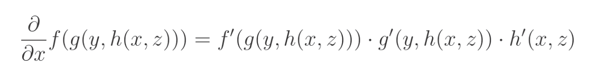

## Gradient

The gradient is a vector of all possible partial derivatives. An example of a triple input function.

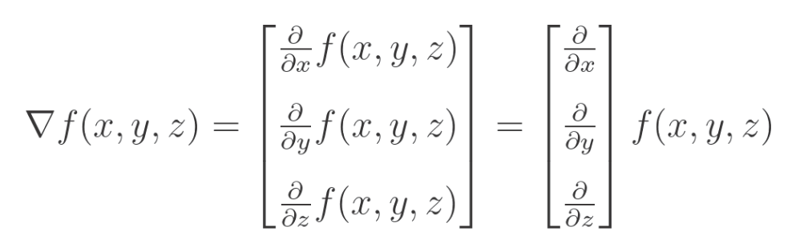