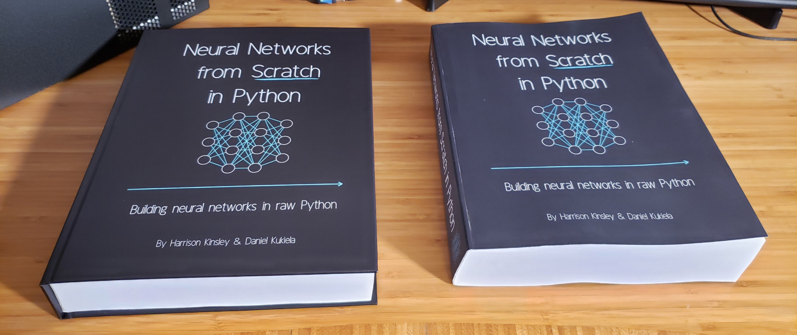

# Neural Network From Scratch

We attempt to create a Neural Network completly from scratch (without the use of any libraries) using the book "Neural Networks from Scratch" by Harrison Kinsley and Daniel Kukiela. The only library we will be using is Numpy (to maintain sanity).

# Table of Contents
1. *~~Introducing Neural Networks (Pg.11-24)~~*
    1. A Brief History
    2. What is a Neural Network?
2. *Coding Our First Neurons (Pg.25-58)*
    1. A Single Neuron
    2. A Layer of Neurons
    3. Tensors, Arrays, and Vectors
    4. Dot Product and Vector Addition
    5. A Single Neuron with Numpy
    6. A Batch of Data
    7. Matrix Product
    8. Transposition for the Matrix Product
    9. A Layer of Neurons and Batch of Data w/ Numpy
3. *Adding Layers (Pg.59-71)*
4. *Activation Functions (Pg.72-110)*
5. *Calculating Network Error with Loss (Pg.111-130)*
6. *Introducing Optimization (Pg.131-138)*
7. *Derivatives (Pg.139-165)*
8. *Gradients, Partial Derivatives, and the Chain Rule (Pg.166-179)*
9. *Backpropogation (Pg.180-248)*
10. *Optimizers (Pg.249-320)*
11. *Testing with Out-of-Sample Data (Pg.321-327)*
12. *Validation Data (Pg.328-331)*
13. *Training Dataset (Pg.332-334)*
14. *L1 and L2 Regularization (Pg. 335-360)*
15. *Dropout (Pg.361-87)*
16. *Binary Logistic Regression (Pg. 388-422)*
17. *Regression (Pg.423-474)*
18. *Model Object (Pg.475-531)*
19. *A Real Dataset (Pg.532-593)*
20. *Model Evaluation (Pg. 594-600)*
21. *Saving and Loading Models and Their Parameters (Pg.601-616)*
22. *Prediction / Inference (Pg.617-660)*

# Credits
This entire Github Repository is dedicated to SentDex. He not only taught me how to program but also how to think like a programmer. I am forever grateful for his tutorials and his dedication to teaching.

YouTube Channel : https://www.youtube.com/watch?v=Wo5dMEP_BbI&list=PLQVvvaa0QuDcjD5BAw2DxE6OF2tius3V3 

Website : https://pythonprogramming.net/

Book Website : https://nnfs.io/ 
